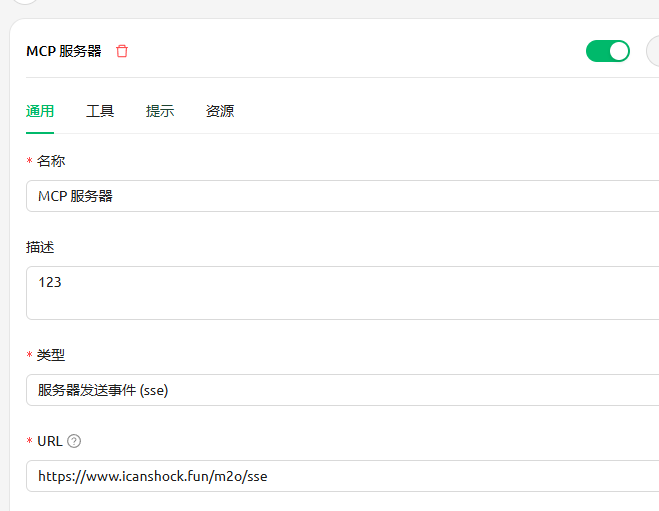

---

## 🧩 项目功能描述

1. **Markdown 转 Excel**
    - 支持解析 Markdown 中的表格数据。
    - 将解析后的表格内容导出为 `.xlsx` 格式的 Excel 文件。

---

## ⚙️ 使用说明

### 1. **使用sse的方式接入**
- 地址：https://www.icanshock.fun/m2o/sse

### 2. **cherry studio配置**

### 3、使用

